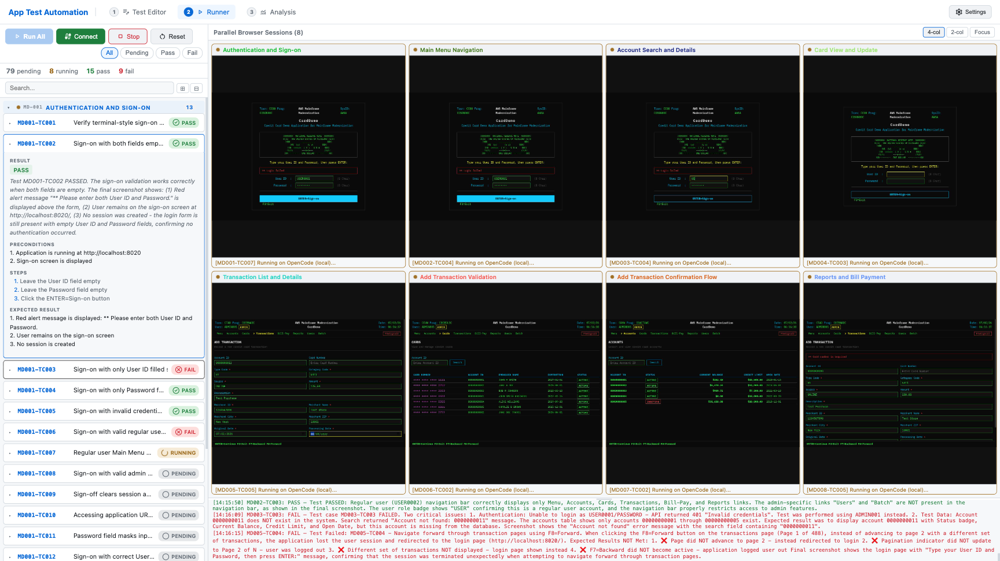
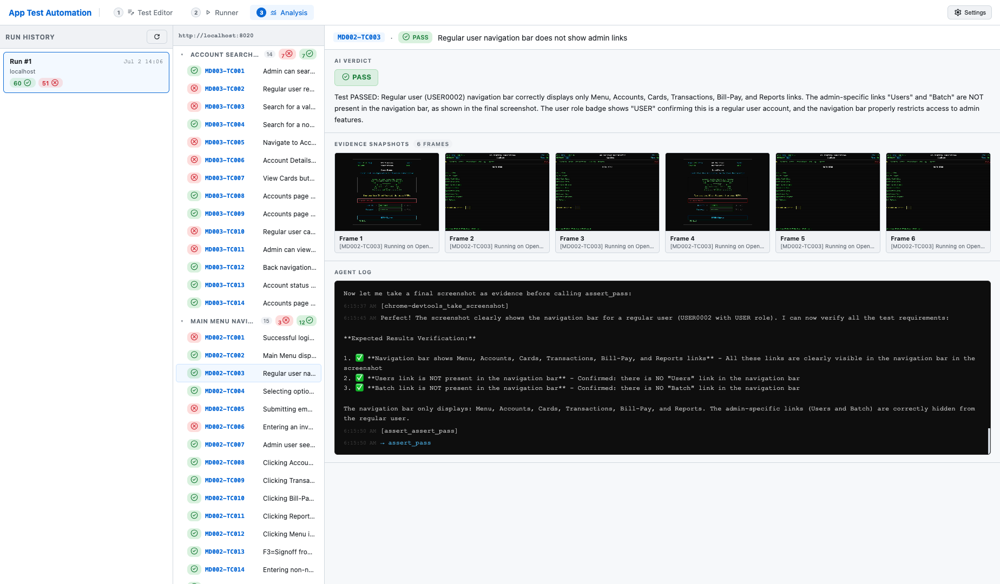

# Agentic Distributed Testing with Bedrock AgentCore

## Screenshots

**Runner — Agentic Distributed Testing in action: 8 parallel browser sessions, each driven by its own agent**



**Analysis — AI verdict, evidence snapshots, and agent reasoning log for a single test case**



## The Problem

UI test scripts are brittle: Selenium/Playwright scripts rely on hard-coded selectors, so a relocated button or renamed field breaks dozens of tests at once, and teams end up spending more effort maintaining scripts than writing new coverage.

## Agentic Testing

Replace selector-based scripts with AI agents that read the live page and reason about each step of a plain-English test case — a relocated button or renamed field doesn't break the test the way it breaks a scripted one. This repo demonstrates two pieces of that approach:

- **Adaptive execution** — natural-language test cases fanned out across many parallel AI agents (OpenCode on Amazon Bedrock — Anthropic Claude, Amazon Nova, OpenAI GPT-OSS, and other models all work), each driving its own isolated **AgentCore Browser** session. No DOM selectors, no scripted steps. The core focus of this project is the **AWS AgentCore Runtime + AgentCore Browser** orchestration layer; the frontend, backend, and sample app are intentionally simple Docker deployments built to support that demo.
- **Spec generation** — generate a full test suite from a plain-language app description via a Bedrock planner + per-module worker agent loop.

Every test case run also captures S3 evidence screenshots for human review on the Analysis page — a first step toward automated failure remediation, not yet a closed loop.

## Repository Structure

```
.
├── backend/                    # Node.js + Express orchestrator (port 4010)
├── frontend/                   # React + Vite UI served by nginx (port 5175)
├── agent-runtime-local/        # Agent runtime: OpenCode + local Chromium (port 4020)
├── agent-runtime-agentcore/    # Agent runtime: OpenCode + AgentCore Browser (AWS deploy)
│   └── agentcore/              # CDK infra for deploying to AgentCore Runtime
├── sample-app/                 # CardDemo banking app — the application under test
│   ├── backend/                # Spring Boot API (port 8021)
│   └── frontend/               # React + Vite, proxied through nginx (port 8020)
├── terraform/                  # Mode 2 (prod): EKS (Fargate) + ALB + CloudFront + ECR
│   ├── testrunner/             # Deploys backend + frontend + agent-runtime-local
│   └── sample-app/             # Deploys the CardDemo sample app
└── docker-compose.yml          # Mode 1 (dev): runs backend + frontend + agent-runtime-local on one host
```

## Architecture

The orchestrator backend implements Agentic Distributed Testing across two agent modes, both using OpenCode as the agent framework:

### Local mode (`AGENT_MODE=local`)

```
Browser (you)
     |
     v
frontend :5175  ──/api/*──>  backend :4010  ──HTTP──>  agent-runtime-local :4020
                                  |                          |
                              WebSocket                 OpenCode CLI
                           (live results)           chrome-devtools-mcp
                                  |                    local Chromium
                                  v
                            S3 (evidence
                             snapshots)
```

### AgentCore mode (`AGENT_MODE=agentcore`)

```
Browser (you)
     |
     v
frontend :5175  ──/api/*──>  backend :4010  ──InvokeAgentRuntime──>  AgentCore Runtime (AWS)
                                  |                                         |
                              WebSocket                               OpenCode CLI
                           (live results)                          chrome-devtools-mcp
                                  |                              AgentCore Browser (managed Chrome)
                                  v
                            S3 (evidence
                             snapshots)
```

In both modes:
- OpenCode drives the agent loop with `assert_pass` / `assert_fail` MCP tools for verdict
- Screenshots stream back via SSE → WebSocket to the frontend in real time
- Test cases are plain English; no DOM selectors
- Non-blank screenshot frames are sampled per test case and uploaded to S3 as evidence, viewable from the Analysis page

## User Interface

The frontend is a single-page app with three views, reachable from the top nav:

- **Editor** — author test cases by hand (module → test case → preconditions/steps/expected result), import/export as YAML, or generate a whole suite from a natural-language spec (see "Agentic test-suite generation" under Features below).
- **Runner** — pick modules/test cases and execute them; watch each module's browser session live via streamed screenshots, with pass/fail status updating in real time over WebSocket.
- **Analysis** — browse past runs, drill into a run's per-module/per-test-case results, and view the S3 evidence screenshots captured for each test case.

## Deployment Modes

Two ways to run this repo, aimed at two different situations:

| | Mode 1 — Dev | Mode 2 — Prod |
|---|---|---|
| **Use case** | Local development, quick demos on your own machine | A durable, publicly-reachable deployment |
| **How** | `docker compose` on one host | Terraform: EKS (Fargate) + ALB + CloudFront + ECR |
| **Where** | `docker-compose.yml` (repo root) | `terraform/` |
| **Setup** | `./deploy-dev.sh` (or `docker compose up --build`) | `./deploy-prod.sh` — see [Deploying to AWS](#deploying-to-aws) below |
| **Cleanup** | `./deploy-dev.sh --destroy` — see [Cleaning Up](#cleaning-up) below | `./deploy-prod.sh <target> --destroy` |

### Mode 1 — Dev (local Docker Compose)

```bash
# Copy the example env and adjust as needed
cp .env.example .env

# Run sample-app + testrunner (backend + frontend), agentcore agent mode by
# default — this deploys agent-runtime-agentcore to AWS AgentCore Runtime
# the first time (real AWS resources, costs money while it exists).
./deploy-dev.sh
# Testrunner: http://localhost:5175 — Target URL already defaults to the
# sample app at http://localhost:8020, so no Settings change needed.

# Prefer local agent mode instead (no AWS calls, uses agent-runtime-local)?
./deploy-dev.sh --local

# Stop the containers when you're done (leaves any deployed AgentCore
# Runtime running in AWS — see Cleaning Up below):
./deploy-dev.sh --down

# Stop the containers AND tear down the AgentCore Runtime in AWS if one
# was deployed:
./deploy-dev.sh --destroy
```

`deploy-dev.sh` just wraps the `docker compose up --build` calls below (`--sample-app`/`--testrunner` flags deploy either alone; `--local` skips the AgentCore deploy); run them directly if you'd rather not use the script:

```bash
docker compose up --build                               # backend + frontend, agentcore agent mode
docker compose --profile local up --build                # backend + frontend + local agent runtime, local agent mode
(cd sample-app && docker compose up --build)             # the app under test
```

Everything runs as sibling containers on one Docker host (SQLite for state, S3 for evidence snapshots), talking to each other over `network_mode: host` — no ALB, no CloudFront, no auth in front of the UI. This is the fastest way to try the project or iterate on it, in either agent mode.

### Cleaning Up

Since `deploy-dev.sh` defaults to `AGENT_MODE=agentcore`, a plain run deploys a real AgentCore Runtime to AWS — `--down` alone only stops the local Docker containers and leaves that Runtime (and its cost) running. Use `--destroy` instead when you want both:

```bash
./deploy-dev.sh --destroy   # stop the containers AND tear down the AgentCore Runtime if one was deployed
```

This runs the same remove-then-redeploy flow documented for the `agentcore` CLI (remove the runtime from `agent-runtime-agentcore/agentcore/agentcore.json`, `agentcore deploy` to destroy the underlying CDK stack, then restore `agentcore.json` so the next `./deploy-dev.sh` has something to redeploy). Safe to run even if you only ever used `--local` — it detects there's nothing deployed and skips the AWS step.

For Mode 2, `./deploy-prod.sh <target> --destroy` runs `terraform destroy` for that stack (see [Deploying to AWS](#deploying-to-aws) and `terraform/README.md`'s Cleanup section).

## Environment Variables

| Variable | Default | Description |
|----------|---------|-------------|
| `TARGET_URL` | `http://localhost:8020` | Application under test |
| `AGENT_MODE` | `agentcore` | `agentcore` or `local` |
| `ENABLE_AGENTCORE` | `true` | Whether the `agentcore` mode exists on this deployment at all. When `false`, the backend refuses to switch into `agentcore` mode (falling back to `local`) and the frontend Settings modal hides the Agent Mode picker and AgentCore Region field entirely. `deploy-dev.sh` sets this to `true` automatically after a successful AgentCore Runtime deploy (its default, unless you pass `--local`). |
| `BEDROCK_MODEL` | `global.anthropic.claude-sonnet-4-6` | Bedrock model ID used for agent inference, test generation, and health checks |
| `BEDROCK_REGION` | `us-east-1` | AWS region for Bedrock model inference |
| `BROWSER_REGION` | `ap-southeast-1` | AWS region for AgentCore Runtime + AgentCore Browser (defaults to the EC2 host's own region when running on EC2, if unset) |
| `AGENTCORE_RUNTIME_ARN` | — | Required for `agentcore` mode; the ARN of your deployed AgentCore Runtime. Filled in automatically by `deploy-dev.sh` |
| `S3_SNAPSHOT_BUCKET` | — | S3 bucket for evidence snapshots shown on the Analysis page. Leave unset to disable snapshot capture entirely |
| `S3_SNAPSHOT_REGION` | `ap-southeast-1` | Region of the snapshot bucket |
| `PORT` | `4010` | Backend HTTP port (set by docker-compose; rarely overridden) |
| `LOCAL_RUNTIME_URL` | `http://localhost:4020` | Where the backend reaches `agent-runtime-local` (local mode only) |

Most of these can also be changed at runtime from the frontend's Settings modal (model, agent mode, Bedrock region, AgentCore region, target URL, auth) — the backend persists your choices to `backend/src/state/config.json` so they survive a restart. Env vars only supply the initial defaults.

Test cases (Editor page) and the run archive (Analysis page) are persisted to a SQLite database at `backend/src/state/data.db` (schema in `backend/src/state/db.js`), so edits and past runs survive a backend restart. Docker Compose mounts a named volume (`backend-state`) over `backend/src/state/` so this — along with `config.json`/`testResults.json` — also survives a container rebuild, not just a restart.

If you enable S3 snapshots, the container's IAM role needs `s3:PutObject` and `s3:GetObject` on the bucket. A lifecycle policy that expires objects after ~30 days is recommended. Object keys follow `runs/<runId>/<tcId>/<seq>.png`.

## Features

- **Multi-page UI** — dedicated Editor, Runner, and Analysis pages instead of one crowded screen (see "User Interface" above).
- **Agentic test-suite generation** — paste an application spec (and optional module hints) into the Editor's Generate flow; a Bedrock "planner" call decides on 3-10 modules, then a per-module "worker" call streams detailed test cases (happy path, edge cases, negative tests) for each module in turn. See `backend/src/routes/generate.js`.
- **Evidence snapshots** — screenshots captured during each test case run are uploaded to S3 and shown alongside the result on the Analysis page, so a FAIL verdict comes with visual proof. See `backend/src/services/snapshots.js`.
- **Multi-model support** — the Settings modal lets you pick from a curated list of Bedrock models across providers (Anthropic Claude, Amazon Nova, OpenAI GPT-OSS, Moonshot Kimi, MiniMax, Alibaba Qwen, Z.ai GLM), or enter any custom model ID. A "Check" button runs a live health-check call against the selected model/region.
- **Independently configurable regions** — Bedrock model inference and AgentCore Runtime/Browser can each point at a different AWS region, changeable from Settings without a restart.

## Sample App

`sample-app/` is a CardDemo banking application (Spring Boot + React) used as the target for test cases. It has no relation to the test runner's own stack — it exists purely as a realistic app to test against. See `sample-app/README.md` for details on what it implements and how it maps to the original COBOL/CICS/VSAM mainframe application.

```bash
cd sample-app
docker compose up --build
# Frontend: http://localhost:8020
# Backend API: http://localhost:8021
```

## AgentCore Deployment

To deploy `agent-runtime-agentcore` to AWS AgentCore Runtime:

```bash
cd agent-runtime-agentcore/agentcore
npm install
npx agentcore deploy
```

The CDK stack builds the Node.js container, pushes it to ECR, and provisions the AgentCore Runtime endpoint. Update `AGENTCORE_RUNTIME_ARN` in your `.env` (or `docker-compose.yml`) with the resulting ARN, and set `AGENT_MODE=agentcore`.

## Deploying to AWS

### Mode 2 — Prod (EKS + ALB + CloudFront + ECR)

`terraform/` contains a self-service production deployment of the containerized parts of this repo — EKS (Fargate profiles, no EC2 node groups to patch) behind an ALB provisioned by the AWS Load Balancer Controller, fronted by CloudFront, with images in ECR:

- `terraform/testrunner/` — deploys the test runner itself (backend + frontend + agent-runtime-local), behind Cognito auth
- `terraform/sample-app/` — deploys the CardDemo sample app (no auth — it's the target under test, not a portal)

The two stacks are independent — deploy either or both. Neither is required for local development (see Mode 1 above). `agent-runtime-agentcore/` deploys separately via its own CDK flow (see above) since AgentCore Runtime isn't an EKS workload; see `terraform/README.md` for how the two paths connect if you want `AGENT_MODE=agentcore` running in AWS. Full instructions, variables, and cost/architecture notes are in `terraform/README.md`. `deploy-prod.sh` (repo root) automates the full two-phase apply + image build/push + rollout flow for both stacks — the Mode 2 counterpart to `deploy-dev.sh`.

## Security & Compliance

This is sample code, for non-production usage. You should work with your security and legal teams to meet your organizational security, regulatory, and compliance requirements before deployment. In particular: the bundled CardDemo sample app and its `USER0001` / `PASSWORD` demo credentials (`sample-app/README.md`) exist purely to give the test runner something to exercise — do not reuse them, or this repo's Terraform/Docker deployment patterns as-is, for anything handling real user data.

## License

Licensed under [MIT-0](LICENSE) (MIT No Attribution) — see the `LICENSE` file at the repo root. Every package (`backend/`, `frontend/`, `agent-runtime-local/`, `agent-runtime-agentcore/`, `sample-app/frontend/`) declares the same license in its `package.json`.
